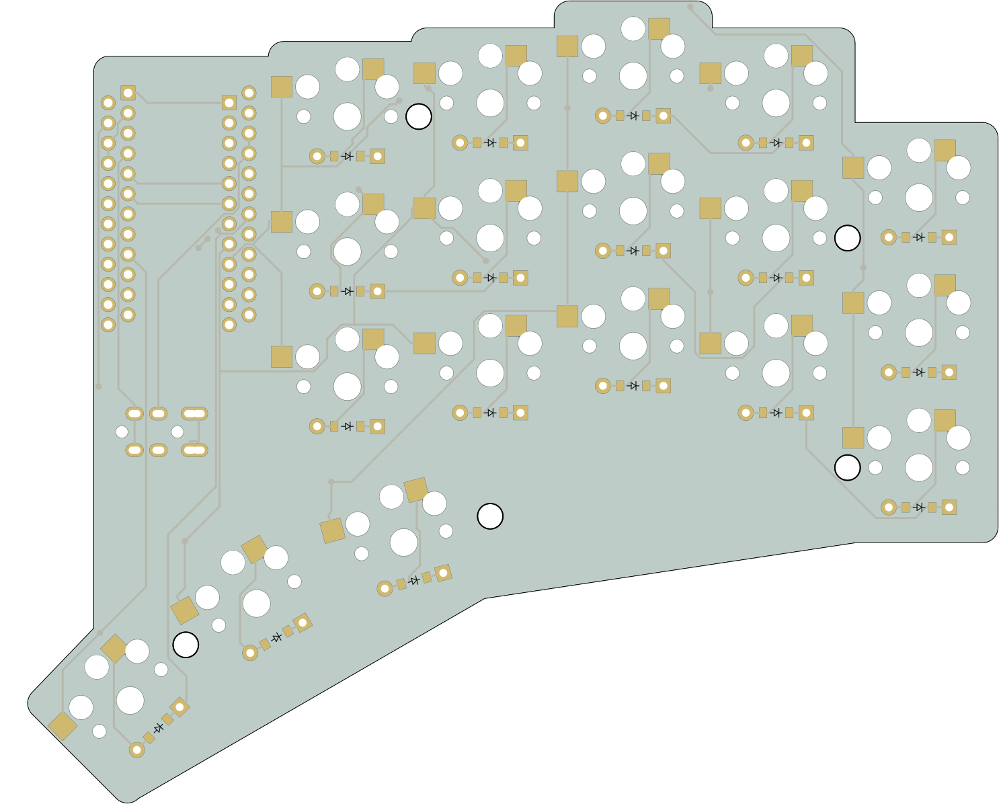

# yamkbd
## Yet another Miryoku keyboard

left | right
-|-
 | 

A 5x3 split keyboard with 3 thumbs. There is nothing interesting about the layout. It's inspired by Corne and Kyria, and
has the exact number of keys needed to run the [Miryoku](https://github.com/manna-harbour/miryoku) layout.

The interesting thing about this keyboard is that it's a declarative design made using [Ergogen](https://github.com/mrzealot/ergogen/). The build system:
* uses Ergogen to translate YAML to a KiCad PCB and plate files for FR2 fab or laser cutting
  * TODO pull out these files from the `output` folder and move them to some other target
* uses [kicad-automation-scripts](https://github.com/productize/kicad-automation-scripts) and [FreeRouting](https://github.com/freerouting/freerouting) to :sparkle: **automatically route the traces on the PCB** :sparkle:
* uses [KiKit](https://github.com/yaqwsx/KiKit) to render PCB previews (see top of this file) and production-ready :sparkle: **Gerber files** :sparkle:

See the [Makefile](Makefile) for more details.
