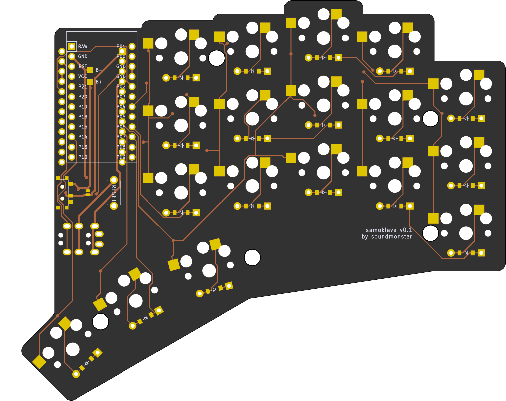

# samoklava
## An autogenerated split 36 key keyboard

## Disclaimer

This is an early experimental prototype. Please do not rely on the autogenerated files and double check them manually
before sending them off to a PCB fab. The author and other random strangers on the internet have been able to produce
working keyboard prototypes from this repo; this does not mean that everything will work every time.

The author(s) waive(s) responsibility for any damage or regulatory violations caused by using this software (see
license). Please consult your local regulations around radio frequencies and what's allowed for DIY projects in your
country.

left | right
-|-
 | 

A 5x3 split keyboard with 3 thumb keys. There is nothing unique about the keyboard layout. It's inspired by Corne and
Kyria, and has the exact number of keys needed for the [Miryoku](https://github.com/manna-harbour/miryoku) layout.

The interesting thing about this keyboard is that it's a declarative design:
* Layout is declared using [Ergogen](https://github.com/mrzealot/ergogen/). See [this fork](https://github.com/soundmonster/ergogen).
* The build system uses Ergogen to translate YAML to a KiCad PCB and plate files for FR-4 fab or laser cutting
* uses [kicad-automation-scripts](https://github.com/productize/kicad-automation-scripts) and [FreeRouting](https://github.com/freerouting/freerouting) to **automatically route the traces on the PCB**
* uses [KiKit](https://github.com/yaqwsx/KiKit) to render PCB previews (see top of this file) and production-ready **Gerber files**

## Features

* Extra pins and a slider switch for battery for wireless Promicro clones (tested with nice!nano); the slider can be
  shorted with a jumper if `CONFIG_ZMK_SLEEP` is preferred.
* Wired operation with QMK should be possible but is not tested; TRRS footprints are included and routed. The pinout is
  identical with a five-column Corne sans the RGBLEDs.
* Reset switches are easily accessible. The footprints used are the same as on the Corne.

## How to

If you would like to modify this:
* fork it
* change `samoklava.yaml` to your liking
* push your changes; the `build.yml` GitHub Workflow will pick it up, autoroute and generate Gerbers, all in a zip file.
  See https://github.com/soundmonster/samoklava/actions
* or:
  * make sure to have Docker CLI and NodeJS installed
  * run `make setup clean all`
  * check the `output` folder for KiCad PCBs and Gerbers

See the [workflow](.github/workflows/build.yml) or the [Makefile](Makefile) for more details.
See [my ZMK config](https://github.com/soundmonster/samoklava-zmk-config) for a suggested keymap.
